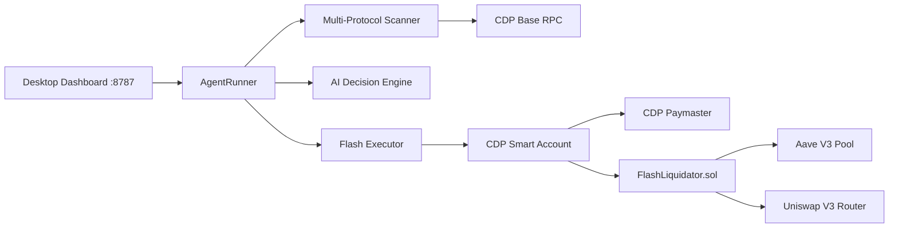

# CDP Flash Liquidation Desktop Agent

Production-grade desktop AI agent for **multi-protocol DeFi liquidations on Base mainnet** (Aave V3, Moonwell, Compound V3, Morpho Blue), powered by the [Coinbase CDP SDK](https://github.com/coinbase/cdp-sdk) with **paymaster gas sponsorship** and **developer-custodied MPC Smart Accounts**.

## Supported Protocols (Base)

| Protocol | Scan | Auto-execute |
|----------|------|----------------|
| **Aave V3** | ✅ | ✅ via `FlashLiquidator.sol` + paymaster |
| **Morpho Blue** | ✅ | ✅ via `MorphoFlashLiquidator.sol` (zero-fee flash loan) |
| **Moonwell** | ✅ | Monitor only (executor TBD) |
| **Compound V3** | ✅ | Monitor only (executor TBD) |

Configure with `AGENT_PROTOCOLS=aave-v3,moonwell,compound-v3,morpho` (default).

### Profit optimizations (research-backed)

- **Live swap quotes** — KyberSwap aggregator (default) + optional 1inch API (`ONEINCH_API_KEY`)
- **Morpho GraphQL API** — fast position discovery with live `healthFactor`
- **Urgency scoring** — lowest HF positions prioritized (competitive edge per MEV research)
- **Watch list** — HF 1.0–1.05 positions prepped for Chainlink oracle triggers
- **Oracle monitor** — ETH/BTC/USDC Chainlink feed polling; rescan on price updates
- **Slippage-aware profit** — configurable `SLIPPAGE_BPS` buffer before execution
- **Simulation gate** — `eth_call` dry-run before paymaster user-op (`SIMULATE_BEFORE_EXECUTE`)

## Architecture



## Quick Start (Desktop)

### 1. Install dependencies

```bash
cd desktop-agent
pip install -r requirements.txt
bash scripts/setup_contracts.sh
```

### 2. Environment

Cloud secrets are auto-injected in Cursor Desktop:

| Secret | Maps to |
|--------|---------|
| `CDP_API_KEY` | CDP API Key ID |
| `CDP_PRIVATE_KEY` | CDP API Key Secret (PEM) |
| `CDP_WALLET_SECRET` | MPC wallet signing secret |
| `EOA_PRIVATE_KEY` | Smart account owner EOA |
| `BASE_RPC_ENDPOINT` | CDP ultra-low-latency Base RPC + paymaster |

### 3. Safe test (Base Sepolia / fork)

```bash
# CDP + scanner smoke test (testnet, read-only)
python scripts/test_base_sepolia.py

# Mainnet state fork via Anvil (read-only)
python scripts/fork_liquidation_test.py
```

### 4. Deploy FlashLiquidator (mainnet)

Add your contract to the **CDP Paymaster allowlist** in [CDP Portal](https://portal.cdp.coinbase.com) before deploying.

```bash
python scripts/deploy_contract.py base
```

### 5. Launch desktop agent

Open the **Desktop** tab in Cursor — the dashboard binds to port `8787`:

```bash
python agent_runner.py --scan-only        # monitor only
python agent_runner.py                    # set EXECUTE_ENABLED=true to liquidate
```

Dashboard: `http://localhost:8787`

## Components

| File | Purpose |
|------|---------|
| `agent_runner.py` | Main orchestrator + dashboard server |
| `contracts/src/FlashLiquidator.sol` | Atomic Aave flash-loan liquidation contract |
| `agent/scanner.py` | On-chain HF scanner + subgraph borrower discovery |
| `agent/executor.py` | CDP Smart Account user-op execution |
| `agent/cdp_wallet.py` | MPC wallet + paymaster integration |
| `agent/ai_engine.py` | Web3 expert AI decision layer |

## Paymaster

On Base, the agent passes `BASE_RPC_ENDPOINT` (CDP RPC URL) as `paymaster_url` to `send_user_operation`, sponsoring gas from your CDP credits.

## Mainnet Execution

```bash
export EXECUTE_ENABLED=true
export FLASH_LIQUIDATOR_ADDRESS=0xYourDeployedContract
python agent_runner.py
```

The agent will:

1. Discover borrowers (Aave subgraph + on-chain Borrow events)
2. Batch-evaluate health factors via `Pool.getUserAccountData`
3. AI/rules engine selects profitable targets
4. Submit atomic `liquidate()` user operation via CDP Smart Account

## Contract

`FlashLiquidator.sol` executes in one transaction:

1. `flashLoanSimple` debt asset from Aave V3
2. `liquidationCall` on underwater position
3. Uniswap V3 swap collateral → debt (if needed)
4. Repay flash loan + premium
5. Transfer profit to Smart Account owner
